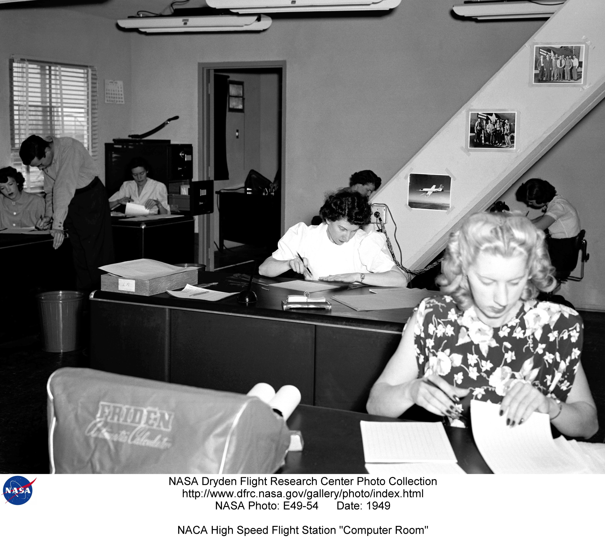

Let's break down the term "Computer Science" into its two parts: **computer** and **science**. What do these words mean?

The word **science** means "knowledge" in Latin. Science is a way of finding out things about the world by asking questions, doing experiments, and looking for evidence.

The word **computer** means "to calculate" in Latin. A computer is a machine that can do math problems and store information very fast. The word **computing** means using computers or other machines to solve problems or do tasks.

But did you know that computers were not always machines? Before electronic computers were invented, there were people who did math problems by hand for scientists and engineers. They were called **human computers**. They followed fixed rules and had no authority to deviate from them in any detail. They worked in teams and checked each other’s results for accuracy.

## Computing Capabilities

Computers, in the broadest sense, are devices that can perform calculations or manipulate information. Throughout history, humans have invented and used various types of computers, each with increasing capabilities and complexity. Here are some examples of how computing capabilities have evolved over time:

- **Tally stick** - One of the earliest forms of computers, dating back to prehistoric times. A tally stick is a piece of wood or bone with notches carved into it to record numbers or events. The computations it could do were incrementing and retrieving one piece of information. For example, a shepherd could use a tally stick to keep track of his sheep by making a notch for each one.
- **Abacus** - A manual device used for calculations by sliding counters along rods or in grooves. The abacus was invented in ancient times and is still used today in some parts of the world. It could store one set of numbers, add, subtract, multiply, divide, and perform other arithmetic operations to the stored information which can later be retrieved. For example, a merchant could use an abacus to keep track of his transactions and profits.
- **Astrolabe** - A sophisticated instrument used for astronomy and navigation by measuring the positions and movements of celestial bodies. The astrolabe was developed in ancient Greece and reached its peak in the Islamic Golden Age. It could perform complex calculations such as determining the time, latitude, longitude, and direction based on the observation of stars and planets. For example, a sailor could use an astrolabe to find his way across the sea by aligning it with the sun or the pole star.
- **Antikythera mechanism** - A mechanical device that simulated the motions of the sun, moon, and planets according to a geocentric model. The Antikythera mechanism was discovered in a shipwreck near the Greek island of Antikythera in 1901. It is estimated to date back to the 2nd century BC and is considered one of the first analog computers. It could predict astronomical phenomena such as eclipses, phases of the moon, and positions of the zodiac signs. For example, a priest could use the Antikythera mechanism to plan religious ceremonies and festivals based on the celestial calendar.
- **Difference engine** - A mechanical calculator that could compute polynomial functions using the method of finite differences. The difference engine was designed by Charles Babbage in the early 19th century but was never fully completed due to technical and financial difficulties. It could generate accurate tables of values for various mathematical functions such as logarithms, trigonometry, and navigation. For example, a mathematician could use the difference engine to check his calculations and avoid errors.
- **Analytical engine** - A proposed mechanical computer that could perform any calculation given a set of instructions or a program. The analytical engine was also designed by Charles Babbage in the mid-19th century but was never built due to his death and lack of funding. It is considered the first general-purpose computer and the precursor of modern computers. It could store data in memory, process data using arithmetic and logical operations, control the flow of execution using conditional branching and looping, and output data using a printer or a punch card. For example, Ada Lovelace, who wrote the first algorithm for the analytical engine, envisioned that it could compose music based on mathematical rules.

Here is a summary of the computing capabilities of some of these devices -

- **Tally stick**: Store and retrieve one piece of data
- **Abacus**: Store and retrieve one piece of data, and perform basic arithmetical operations on them with another operand.
- **System of Gears**: Store and retrieve one piece of data. Each gear can use stored data and scale it up or down (multiply or divide) by a fixed constant determined by the gear ratio.​
- **Difference engine**: Can perform complex, but non-programmable computations. Produced tables of input-output pairs.
- **Analytical engine**: Can perform complex, programmable computations. Can store data in memory, process data using arithmetic and logical operations, control the flow of execution using conditional branching and looping, and output data using a printer or a punch card.

## What is Computer Science then?

The science of computers, or Computer Science, seeks to answer fundamental questions like: What are the essential parts of a computer? What can be computed, and what cannot? What determines the ease and speed of computation? This field provides the foundation for understanding the principles that drive computational systems.

## Data Structures and Algorithms

The field of Data Structures and Algorithms expands upon the principles of Computer Science. It determines the efficiency of computation by answering the question: How easily or quickly can something be computed, and what factors influence these metrics? It outlines the necessary building blocks or tools required for programming, and explores the common patterns and problems in programs, offering known ways to enhance their speed. It is this branch of Computer Science that gives us the skills to design, write and analyze the efficiency of our programs. This understanding is crucial to becoming proficient in the broader field of Computer Science.

In essence, the intertwined journey of computers and computing science is a testament to human ingenuity and the relentless pursuit of understanding and harnessing the principles that underlie our world. As we delve deeper into the concepts of data structures and algorithms, we continue to contribute to this exciting journey.

## Review

We talked a little about what computers are, and what capabilities a device needs to have to be able to compute certain types of problems.​
The next chapter will be about “general purpose, programmable computers”, and how they work.

Here's a fun exercise for you -

- Are analog wristwatches computers? What do they compute?
- Can you design a system of gears that can convert Fahrenheit to Celcius?
