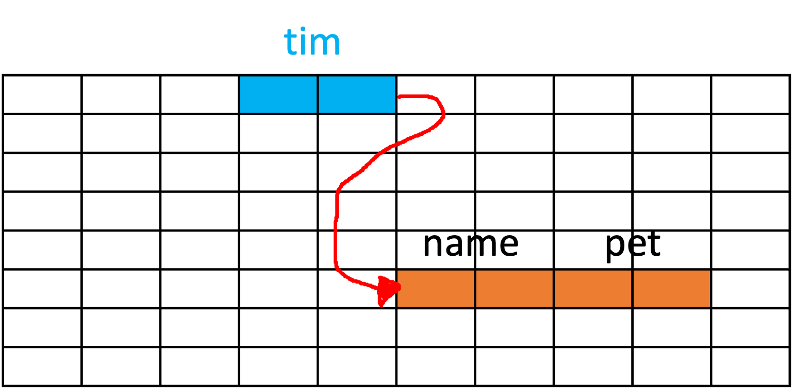
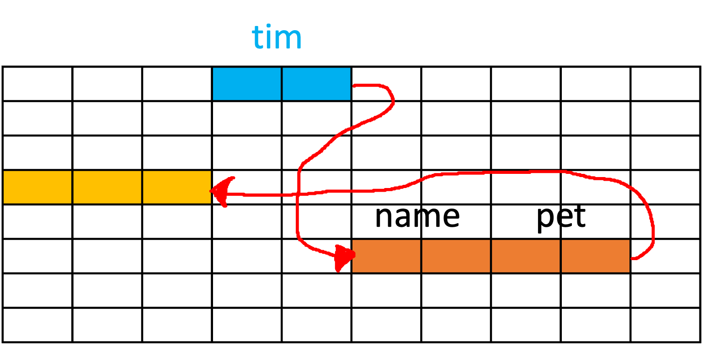
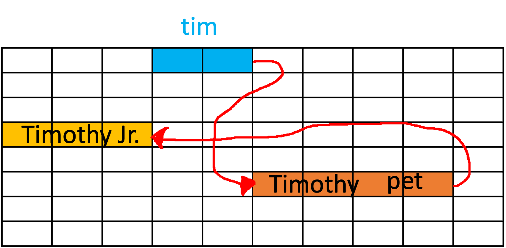
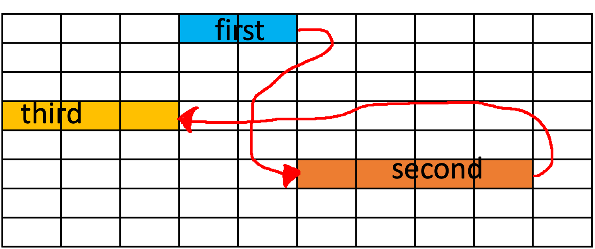

In this chapter, we'll take a closer look at how objects interact in Java. To fully understand this interaction, we first need to grasp the concept of references in Java, memory allocation for Java objects, and how different objects can interact through references. Later, we'll also examine how these principles apply to implementing linked lists in Java.

## Understanding References in Java

In Java programming, the statement that "all objects are references" is a cornerstone. Understanding what this statement means is a fundamental step in mastering Java.

In Java, when we say an object is a _reference_, it means that the object acts as an address pointer, referencing a specific location in memory. This location is where the actual data associated with that object is stored.

Consider your computer's memory as a large grid, as illustrated in Table 6.1. Each cell can store some data.

| 0 | 0 | 0 | 0 | 0 | 0 | 0 | 0 | 0 | 0 |
| :-: | :-: | :-: | :-: | :-: | :-: | :-: | :-: | :-: | :-: |
| 0 | 0 | 0 | 0 | 0 | 0 | 0 | 0 | 0 | 0 |
| 0 | 0 | 0 | 0 | 0 | 0 | 0 | 0 | 0 | 0 |
| 0 | 0 | 0 | 0 | 0 | 0 | 0 | 0 | 0 | 0 |
| 0 | 0 | 0 | 0 | 0 | 0 | 0 | 0 | 0 | 0 |
| 0 | 0 | 0 | 0 | 0 | 0 | 0 | 0 | 0 | 0 |
| 0 | 0 | 0 | 0 | 0 | 0 | 0 | 0 | 0 | 0 |
| 0 | 0 | 0 | 0 | 0 | 0 | 0 | 0 | 0 | 0 |
:  Representation of computer's memory

For any object in Java, it's not the data of the object that is directly stored in the variable, but rather the _reference_ to the data.

## Memory Allocation for Java Objects

Consider the following example, in which we have a `Dog` class.

```java
public class Dog {
    String name;
    int age;
}
```

Initially, the `Dog` class doesn't occupy any memory space. It simply serves as a blueprint for creating `Dog` objects.

Now, let's create a new instance of `Dog` and assign it to the variable `myDog`:

```java
Dog myDog = new Dog();
```

This operation performs two main actions:

1. Memory is allocated for a new `Dog` object.
2. The address of that memory is stored in the `myDog` variable.


So, `myDog` is essentially a pointer that points to the location in memory where the `Dog` object's data is stored.

## 6.3 Objects Interacting Through References

Now, let's consider a scenario where we have two classes, `Dog` and `HomeOwner`. The `Dog` class is the same as before, but the `HomeOwner` class is a bit more complex.

```java
public class HomeOwner

 {
    String name;
    Dog pet;
}
```

Here, the `HomeOwner` class has a `pet` field of type `Dog`. This means a `HomeOwner` can own a `Dog`.

Now, suppose we have a constructor in the `Dog` class that accepts `name` and `age` as parameters, and a default constructor in the `HomeOwner` class:

```java
public class Dog {
    String name;
    int age;
    
    public Dog(String name, int age) {
        this.name = name;
        this.age = age;
    }
}

public class HomeOwner {
    String name;
    Dog pet;

    public HomeOwner() {
        this.name = "Timothy";
        this.pet = new Dog("Timothy Jr.", 5);
    }
}
```

When we create an instance of `HomeOwner`:

```java
HomeOwner owner = new HomeOwner();
```



A new `Dog` object is created and assigned to the `pet` field of the `HomeOwner` object. Importantly, the `pet` field stores the _reference_ to the `Dog` object, not the actual `Dog` object data.



This creates a chain of references in memory, with the `owner` variable pointing to the `HomeOwner` object, which in turn has a reference to the `Dog` object.



This understanding of references and memory allocation sets the foundation for how linked lists work in Java, which we will explore in the upcoming sections.

## Implementing Linked Lists in Java

Absolutely! Last time, we used arrays to construct lists, but we can indeed build a list using the concept of references we have just discussed.

We'll start by creating a class where we'll store a reference to the first piece of data in our List. Then, our first piece of data will contain a reference to the next piece, and the next piece will point to the one following it, and so on.



This gives us the following structure:

```java
class LinkedList {
  firstPieceOfData head;
}

class firstPieceOfData {
  nextPieceOfData next;
}
```

However, there's no actual data in this structure yet.

So, how about this?

```java
class LinkedList {
  firstPieceOfData head;
}

class firstPieceOfData {
  nextPieceOfData next;
  actualData data;
}

class nextPieceOfData {
  nextPieceOfData next;
  actualData data;
}
```

To ensure our list is flexible and can store any type of data, we should make it generic:

```java
class LinkedList<T> {
  firstPieceOfData<T> head;
}

class firstPieceOfData<T> {
  nextPieceOfData<T> next;
  T data;
}

class nextPieceOfData<T> {
  nextPieceOfData<T> next;
  T data;
}
```

Here, `<T>` is a type parameter that allows us to define a class with placeholders for the types they use, which we can specify when we create an instance of the class.

We can also observe that `firstPieceOfData` and `nextPieceOfData` are structurally the same, as both classes store a reference to an object that holds data, and both hold some actual data. We can therefore simplify our structure by using a single class for both, like so:

```java
class LinkedList<T> {
  Node<T> head;
}

class Node<T> {
  Node<T> next;
  T data;
}
```

The list we've created is known as a _singly linked list_. In some algorithms, we may want to access the previous node. In that case, we can store a reference to the previous node as well, creating what's known as a _doubly linked list_:

```java
class LinkedList<T> {
  Node<T> head;
  Node<T> tail;
}

class Node<T> {
  Node<T> next;
  Node<T> prev;
  T data;
}
```

When we create a `Node` object, the constructor should initialize the `next` reference to `null` and `data` to the data we pass in. This is because at that point, we don't yet know what the next node will be, but we do know what data we want to store.

```java
class SinglyLinkedNode<T> {
  private SinglyLinkedNode<T> next;
  private T data;

  public SinglyLinkedNode(T data) {
    this.data = data;
    this.next = null;
  }
}
```

We also renamed the `Node` class to `SinglyLinkedNode` to make it clear that this is for a singly-linked list.

The constructor for `SinglyLinkedList` will just set the head to null, initializing it as an empty list.

```java
class SinglyLinkedList<T> {
  private SinglyLinkedNode<T> head;

  public SinglyLinkedList() {
    this.head = null;
  }
}
```

## 6.5 Adding to a Singly Linked List

The `SinglyLinkedNode`

 class needs getter and setter methods for accessing and modifying its private data and next fields.

```java
class SinglyLinkedNode<T> {
  private SinglyLinkedNode<T> next;
  private T data;

  public SinglyLinkedNode(T data) {
    this.data = data;
    this.next = null;
  }

  public SinglyLinkedNode<T> getNext() {
    return this.next;
  }

  public void setNext(SinglyLinkedNode<T> next) {
    this.next = next;
  }

  public T getData() {
    return this.data;
  }

  public void setData(T data) {
    this.data = data;
  }
}
```

With the getters and setters in place, we can now turn our attention to adding a new node to the list. Here's what we need to do when the list is empty:

```java
public class SinglyLinkedList<T> {
  private SinglyLinkedNode<T> head;

  public SinglyLinkedList() {
    this.head = null;
  }

  public void add(T data) {
    head = new SinglyLinkedNode<T>(data);
  }
}
```

When we're adding elements or nodes to our singly linked list, we've seen that for the first addition, we simply set the head to a new node with the provided data. This is essentially the creation of the first element or node in our list.

Let's take a moment to visualize this scenario:

```
head --> [A]
```

In this ASCII diagram, the `-->` represents the link from the `head` to the first node `A`.

Now, when we're adding a second element, we must be careful. We can't simply overwrite the `head` again, as it contains our first piece of data. Instead, we want to add our new node at the next available position.

We achieve this by setting the `next` member of the head node to point to our new data, like so:

```java
public void add(T data) {
  if (head == null) {
    head = new SinglyLinkedNode<T>(data);
  } else {
    head.setNext(new SinglyLinkedNode<T>(data));
  }
}
```

The updated state of the list is now:

```
head --> [A] --> [B]
```

But what if we want to add a third node? Using the code above, we would inadvertently overwrite the link from `A` to `B`, and instead, link `A` directly to the new node.

We have to revise our strategy. What if we checked whether the `next` of the head was null and then added our new node there?

```java
public void add(T data) {
  if (head == null) {
    head = new SinglyLinkedNode<T>(data);
  } else if (head.getNext() == null) {
    head.setNext(new SinglyLinkedNode<T>(data));
  } else {
    head.getNext().setNext(new SinglyLinkedNode<T>(data));
  }
}
```

This would result in:

```
head --> [A] --> [B] --> [C]
```

That seems to work, right? But this code has limitations; it only accommodates the addition of up to three nodes.

Let's observe what happens when we add a fourth node using this code. We'd end up with:

```
head --> [A] --> [B] --> [D]
```

The third node, `[C]`, disappears! That's not what we want. We need a way to add nodes to our list, regardless of its current length. Can you see a pattern forming in how we're adding nodes? How about a loop to iterate over the list until we find a node with a `null` `next` field?

```java
public void add(T data) {
  if (head == null) {
    head = new SinglyLinkedNode<T>(data);
  } else {
    SinglyLinkedNode<T> current = head;

    while (current.getNext() != null) {
      current = current.getNext();
    }

    current.setNext(new SinglyLinkedNode<T>(data));
  }
}
```

Now, each time we call `add()`, we start at the head and follow the `next` references until we find a node where `next` is `null`. We then set that node's `next` to the new node, effectively adding it to the end of the list.

And there you have it! We've cracked the code for adding nodes to a singly linked list, regardless of its size.

## Searching a Singly Linked List

Having explored the intricacies of adding elements to our singly linked list, it's only logical to now ask, "How can we find an element in our list?" After all, what good is storing data if we can't retrieve it?

Let's delve into the process of developing a `search` method that behaves similarly to the `indexOf` method in the Java standard library. Our `search` method should return the index of the first occurrence of a given element in the list and `-1` if the element is not found.

Before we get started, there's an important update we need to make to our generics. We'll be comparing objects in our list to the search target, which means we need to ensure these objects are comparable. To do this, we'll update `T` to `T extends Comparable<T>`. This ensures that the type `T` implements the `Comparable` interface, providing us with the ability to compare objects of this type.

```java
class SinglyLinkedNode<T extends Comparable<T>> {
  private SinglyLinkedNode<T> next;
  private T data;

  //...
}

class SinglyLinkedList<T extends Comparable<T>> {
  private SinglyLinkedNode<T> head;

  //...
}
```

Alright, with this adjustment in place, let's get to developing our `search` method!

If you reflect on how we traverse our linked list, it may become clear that the same process can be utilized for searching. We start at the `head`, and we progress through the list via the `next` pointers until we either find our target or reach the end of the list.

Here's a potential implementation for the `search` method:

```java
public int search(T target) {
  SinglyLinkedNode<T> current = head;
  int index = 0;

  while (current != null) {
    if (current.getData().compareTo(target) == 0) {
      return index;
    }
    index++;
    current = current.getNext();
  }

  return -1;  // Target not found
}
```

Let's examine this piece by piece. We start by creating a reference to the `head` of our list and initializing an `index` variable at `0`. We then enter a `while` loop that will continue as long as `current` is not `null`, effectively iterating over the entire list.

Inside the loop, we compare the data of the `current` node to our `target` using the `compareTo` method, which is available to us thanks to our `Comparable` constraint. If the data matches our target (`compareTo` returns `0`), we've found our target and we return the current index.

If the data does not match our target, we increment our `index` and move to the next node in the list. If we reach the end of the list without finding our target, the method returns `-1`, indicating the target is not in the list.

And that's how we develop a search method for our singly linked list, providing us with the means to locate and retrieve data efficiently!

## Removing from a Singly Linked List

Just as we learned how to add elements to a singly linked list, let's now turn our attention to the process of removing elements. As with adding elements, we'll start with a simpler case and gradually address more complex scenarios. We'll design a `removeLast` method, which removes the last node from the list.

There are three scenarios we need to consider:

1. The list is empty.
2. The list contains only one element.
3. The list contains more than one element.

### Case 1: Empty Linked List

The simplest scenario to handle is an empty list. If the list is empty, we have nothing to remove. Here's a simple starting point for our `removeLast` method:

```java
public void removeLast() {
  if (head == null) {
    return; // Nothing to remove.
  }
}
```

This code handles an empty list by simply returning without doing anything.

### Case 2: Linked List with One Element

Now, let's consider the case where our list contains only one element.

To remove the only element from the list, we would set `head` to `null`, effectively removing the link to that node.

Here's how our `removeLast` method looks now:

```java
public void removeLast() {
  if (head == null) {
    return; // Nothing to remove.
  } else if (head.getNext() == null) {
    head = null; // Remove the only node in the list.
  }
}
```

### Case 3: Linked List with More Than One Element

When the list contains more than one element, we must find the last node and the node before it. Why? Because to remove the last node, we must set the `next` field of the node before it to `null`.

Let's think about how we might achieve this. We can't simply set `head.getNext() = null` like we did with the one-element list, because this would leave us with only the first node.

Instead, we could use a loop similar to the one in the `add` method, but with a twist. Instead of stopping when `current.getNext() == null`, which would leave us at the last node, we stop when `current.getNext().getNext() == null`, which will leave us at the second-to-last node.

```java
public void removeLast() {
  if (head == null) {
    return; // Nothing to remove.
  } else if (head.getNext() == null) {
    head = null; // Remove the only node in the list.
  } else {
    SinglyLinkedNode<T> current = head;
    while (current.getNext().getNext() != null) {
      current = current.getNext();
    }
    current.setNext(null); // Remove the last node from the list.
  }
}
```

Now, we have a `removeLast` method that handles any size list!

### Moving to `remove(int i)`

Removing the last node from a list is a good starting point, but what if we want to remove an arbitrary node at index `i`?

For this, we would need to iterate over the nodes until we reach the `(i-1)`th node (just before the node we want to remove), then update its `next` field to skip over the `i`th node and link to the `(i+1)`th node.

However, this requires careful checking of edge cases, such as when `i` is `0` (requiring us to update the `head`), or when `i` is greater than the size of the list.

This will be our next challenge to tackle!
Let's see how we can go about creating a `remove(int i)` method, which will remove a node at a given index from our singly linked list.

As previously mentioned, our approach will be to traverse the list until we reach the `(i-1)`th node, and then adjust its `next` field to skip the `i`th node, effectively removing it from the list.

Here's a basic version of this method:

```java
public void remove(int i) {
  if (i == 0) {
    head = head.getNext(); // If the node to remove is the head, move the head to the next node.
  } else {
    SinglyLinkedNode<T> current = head;
    for (int j = 0; j < i - 1; j++) {
      current = current.getNext();
    }
    current.setNext(current.getNext().getNext());
  }
}
```

This is a simple implementation, but it lacks protection against edge cases. For instance, what happens if `i` is negative or if it's larger than the size of the list?

We can address these cases by adding a few checks to our method:

```java
public void remove(int i) {
  if (i < 0) {
    return; // Do nothing for negative index.
  } else if (i == 0) {
    head = head.getNext(); // If the node to remove is the head, move the head to the next node.
  } else {
    SinglyLinkedNode<T> current = head;
    for (int j = 0; j < i - 1; j++) {
      if (current.getNext() == null) {
        return; // If the index is out of range, do nothing.
      }
      current = current.getNext();
    }
    if (current.getNext() != null) {
      current.setNext(current.getNext().getNext());
    }
  }
}
```

This updated method takes care of any negative index or index that's out of range by simply returning without making any changes. If the index is zero, we update the head of the list to be the next node. If the index is within the range of the list, we find the node at `(i-1)` and update its `next` reference to skip over the `i`th node.

And with that, we've covered the basics of how to add and remove nodes from a singly linked list!

### Summary and Conclusion

In this chapter, we learned how to implement linked lists in Java using references and objects. We saw how references can point to other objects in memory and how we can use them to create nodes that store data and link to other nodes. We also learned how to define a class for a singly linked list that contains a reference to the first node, called the head, and methods for adding, searching, and removing elements. We compared the advantages and disadvantages of linked lists with array-backed lists and discussed some applications of linked lists in real-world problems. We concluded that linked lists are a dynamic and flexible data structure that can grow and shrink as needed, but they also have some drawbacks such as extra memory overhead, lack of random access, and potential memory leaks.
