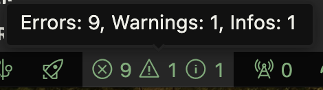
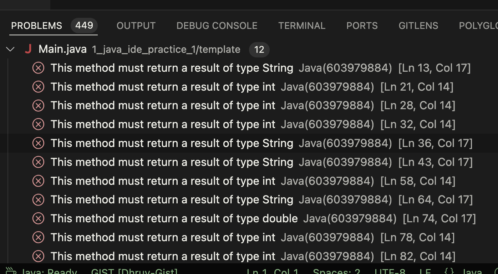
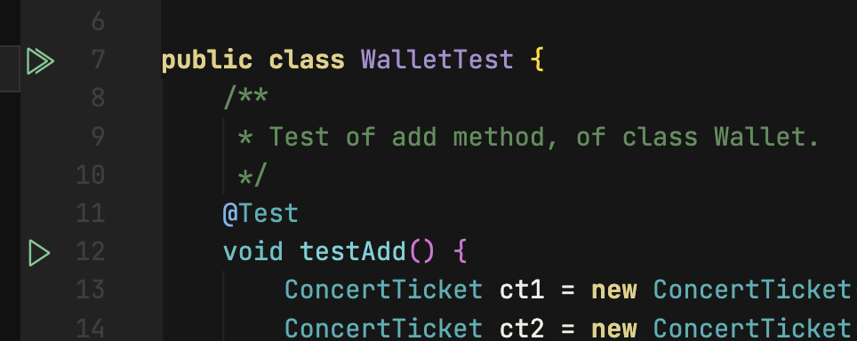

---
title: "3L. Test-Driven Development"
---

## Update Auto-grader

First, update the auto-grader by running the following command:

```bash
umm update 
```

## Opening Project in IDE

Project files: [3L_test-driven-development.zip](https://www.dropbox.com/scl/fi/bij5z8o9dl5ofgz7pfdjc/3L_test-driven-development-TEMPLATE.zip?rlkey=6j924rgd2llmss7u0tod2t6a8&raw=1)

1. Unzip the files preferably into an `ITSC 2214` folder for this class.  This folder should serve as the parent directory for all labs related to the class.
2. Open Visual Studio Code.
3. Go to `File > Open Folder` and choose the folder where you extracted the files.

## Checking Grade

You can check your grade without hitting check answer by following these steps:

### Using Terminal

1. Open a terminal. To open a terminal in Visual Studio Code on different operating systems:
    - **Windows:** Press `Ctrl + `` or`Ctrl + Shift + ` to open the integrated terminal.

    - **Mac:** Press `Cmd + `` or`Cmd + Shift + ` to open the integrated terminal.
2. Run the command:

    ```bash
    umm grade ./script.rhai
    ```

### Watch

1. [How to check for compiler errors is VSCode](https://capture.dropbox.com/ojlTIhxa3CEgUO9m)

2. [Installing and Using Codeium](https://www.youtube.com/watch?v=gIPSEyMoiMM)

## Project Overview

Here are the files in your project for the ConcertTicket package:

```
.
├── src/
│   └── ConcertTicket/
│       ├── ConcertTicket.java
│       └── Wallet.java
└── test/
    └── ConcertTicket/
        └── WalletTest.java
```

Using the files tab on the left, double-click on the `ConcertTicket.ConcertTicket` class and the `ConcertTicket.Wallet` class.

Get familiar with these files and read through the comments!

## Implementation Instructions

1. **Implement `getSize()` Method**
    - The size is the number of tickets currently present in the wallet.

2. **Implement `getLength()` Method**
    - The length is the capacity of the wallet - the maximum number of tickets our wallet can hold.

3. **Implement `remove` Method**
    - There is no method for removing a `ConcertTicket` from the wallet! Your job is to write that method. The method should be called `remove`. It should take no parameters and it should return the most recently added `ConcertTicket`.

    ```java
    public ConcertTicket remove() {
        // Create a ConcertTicket reference variable (DO NOT create a
        // new ConcertTicket - JUST create the reference variable)

        // Use the size variable (which always points at the next empty
        // slot) to get the last added ConcertTicket from the array:

        // Set that array slot to null:

        // Decrement the size variable:

        // Return the Concert Ticket:
    }
    ```

4. **Checking for Errors**
    - Once you are done, make sure there are no syntax errors. You can do so by opening the problems view by clicking on this button in the bottom left:

        

    - Which opens this tab:

        

5. **Running Tests**
    - If there are no errors, go to `WalletTest.java` in the `test/ConcertTicket` folder. Click on the thick double green arrow on line 7 to run all tests -

        

6. **Submitting**
    - If all tests have passed, hit submit!

## Rubric

- **Project must compile to receive a grade.**
- **All tests for `ConcertTicket.WalletTest` must pass (25 points).**

## Submission

1. You can copy and run the `umm create-submission` command in the terminal, and that should create a zip file with a name similar to `submission-2024-01-24-15-04-50.zip`.

    ```bash
    umm create-submission
    ```

2. Submit the `submission-2024-... .zip` file to Gradescope. The submission zip file will appear in the file explorer tab of VS Code. You can right-click on this file and click on `Reveal in Explorer` (windows) or `Reveal in Finder` (mac) in order to find this file. Then, you can drag and drop this to Gradescope for submission.
